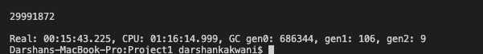

# Perfect-Squares

## Problem Definition

Given inputs N and k, the program has to calculate all such numbers where 1<sup>2</sup> + 2<sup>2</sup> + ... + k<sup>2</sup> = a perfect square. We will run this for k such consecutive numbers starting from 1 and going up to N. For example, if N = 40 and k = 24, then one of the ouputs will be 1 since, 1<sup>2</sup> + 2<sup>2</sup> + 3<sup>2</sup> + .. + 24<sup>2</sup> = 70<sup>2</sup>. So we need to output the starting number of the series which given a perfect square.

## Languages Used & How to Run

We have used F# and Akka with .NET in order to run this code as F# is a functional programming language which helps in running processes in paralled on multi-core machines. Akka here provides the actors to F# which are agents that help in paralle execution and more utilisation of CPU time rather than real time.

The project can be run using the following command:
```bash
dotnet fsi --langversion:preview proj1,fax arg1 arg2
```
where arg1 = N, arg2 = k

## Algorithm / Approach Used

There is a boss actor which is called when the input is provided through the command line. This actor helps in providing work to its worker i.e., other actors. After the input is received, it is divided into 10 parts and sent to each worker. For our code and our machines, the most optimum solution was to use 10-15 actors. We arrived at this number usign trial and error.

The sum of squares in each actor is calculated using a sliding window protocol which takes O(N) time to calculate the squares of number from 1 to N. Then each calculated square is passed to a aquare root function that calculated if the number os a perfect square using binary search in O(log N) time.

## Inputs and Outputs

The following were the inputs and output for inputs with different sizes and different number of actors performed on a machine with 4 cores. The CPU to Real time ration on an average is 5.00. In order to check the CPU and Real time, we used the "#time "on"" line in our code.
For the worker unit, we decided to divide the input into 10 parts and giving an equal chunk to each worker.

Input: N = 1000000 (10<sup>6</sup>), k = 4
Number of Actors: 15
CPU Time: 56.301 sec
Real Time: 10.620 sec
Ration: 5.30


Input: N = 1000000 (10<sup>6</sup>), k = 4
Number of Actors: 22
CPU Time: 42.802 sec
Real Time: 8.143 sec
Ration: 5.25


## Largest Problem we managed to Run

Input: N = 100000000 (10<sup>8</sup>), k = 24
Number of Actors: 10
CPU Time: 1 hr 16 min 14.999 sec
Real Time: 15 min 43.225 sec
Ration: 4.85


Input: N = 100000000 (10<sup>8</sup>), k = 24
Number of Actors: 16
CPU Time: 1 hr 17 min 58.174 sec
Real Time: 16 min 32.294 sec
Ration: 4.71

